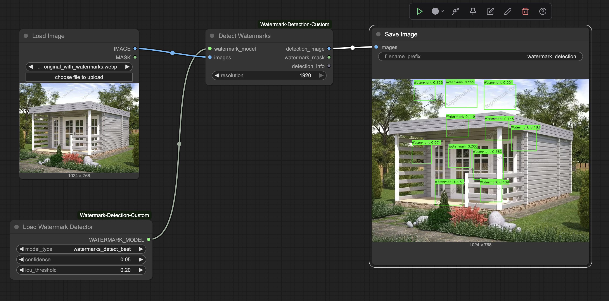

[](https://www.python.org/) [](https://www.comfy.org/)

# ComfyUI Watermark Detection Custom Node

Advanced watermark detection using a custom trained YOLO11 model with special support for fading watermarks.

## 🚀 Features

- **High Accuracy**: Custom model trained on 24,558 watermark images. Thanks to https://universe.roboflow.com/idevelop/watermarks-fczjj/dataset/1
- **Multi-Resolution**: Supports 640px, 1280px, 1920px detection
- **Fading Watermarks**: Low confidence threshold for transparent watermarks
- **Binary Masks**: Clean mask output for post-processing
- **Detailed Info**: Bounding box coordinates and confidence scores

## 📦 Installation

### Via ComfyUI Manager (Recommended)

1. Open ComfyUI Manager
2. Search for "Watermark Detection Custom"
3. Click Install

### Manual Installation

```bash
cd ComfyUI/custom_nodes/
git clone https://github.com/soliton80/ComfyUI-Watermark-Detection-YOLO.git
cd ComfyUI-Watermark-Detection-YOLO
pip install -r requirements.txt
```

## 🎯 Usage

1. **Load Watermark Detector**: Uses the trained `watermarks_detect_best` model
2. **Detect Watermarks**: Process images with configurable confidence/IOU
3. **Save Results**: Export detection images and masks
3. **Confidence pointer**: Hold lower confidence pointer for weak visible watermarks
4. **Resolution Option**: Put resolution higher for weak visible watermarks

## 📊 Model Performance

Trained on diverse watermark dataset including:

- Text overlays and logos
- Semi-transparent watermarks
- Various positions and sizes
- Multi-language text watermarks

## 📥 Example workflow



## 🤝 Issues

Issues are welcome!

## 📄 License

MIT License - see LICENSE file for details.
